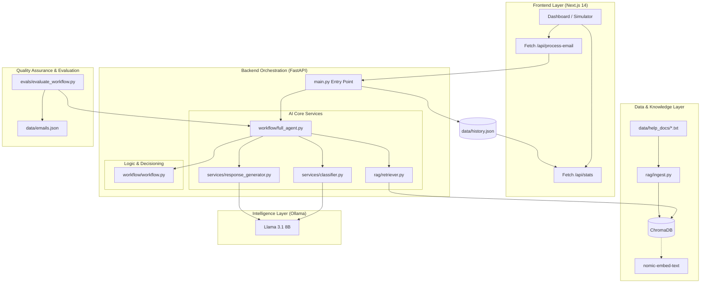

# Lumen AI: Production-Grade Customer Support Orchestration System

Lumen AI is a high-fidelity, local-first support automation engine designed to bridge the gap between raw LLM reasoning and deterministic business logic. By combining Semantic RAG Retrieval, Hybrid Orchestration, and Real-Time Observability, Lumen provides a scalable solution for SaaS companies to automate their support workflows without sacrificing accuracy or data privacy.

---

## Technical Architecture

Lumen follows a modular pipeline design, ensuring each request is classified, grounded, and validated before any response is generated.

```text
       Customer Email
             |
[ 1. AI Intent Classifier ] ---> (Category, Urgency, Sentiment)
             |
[ 2. Semantic Retriever ] <--- (ChromaDB + Help Docs)
             |
[ 3. Workflow Orchestrator ] ---> (Deterministic Routing Rules)
             |
[ 4. Response Generator ] ---> (Grounded Contextual Reply)
             |
[ 5. Observability Dashboard ] ---> (Metrics, Latency, Logs)
```

---

## Full System & Codebase Mapping

The following diagram illustrates the complete project ecosystem, showing how the frontend, backend services, and vector database interact to provide a seamless automation experience.



---

## Deep System Design & Technical Implementation

This section details the low-level implementation of each component and how they interact within the Python/FastAPI ecosystem.

### 1. NLP Intent Classification (`EmailClassifier`)
The classification layer uses a zero-shot prompting strategy on Llama 3.1.
*   **Prompt Engineering**: We use a system-level role definition that constrains the LLM to output ONLY a JSON object. This eliminates the need for expensive post-processing or regex cleaning.
*   **Data Structure**: The `classify` function returns a dictionary with `category`, `urgency`, and `sentiment`.
*   **Error Handling**: If the LLM fails to return valid JSON (a common issue with smaller models), the code implements a **graceful fallback** to a `technical_issue` category to ensure the pipeline doesn't crash.

### 2. Semantic Vector Space (`RAG System`)
The retrieval system is built on top of ChromaDB and the `nomic-embed-text` model.
*   **Embedding Logic**: Documents are transformed into 768-dimensional vectors. When a query comes in, we perform a **K-Nearest Neighbors (KNN)** search.
*   **Thresholding**: We don't just take any result; we calculate a **Retrieval Fit Score**. If the similarity distance is too high, the system flags the result as "low confidence," which the Orchestrator uses to decide whether to trust the AI response.
*   **Persistence**: The vector database is stored locally in the `/db` directory, allowing for instant search without external API calls.

### 3. The Orchestration Logic (`AIWorkflowOrchestrator`)
This is the core "Business Brain" that sits between the AI and the Customer.
*   **Deterministic Gates**: The system uses hardcoded logic gates. For example:
    *   `if sentiment == "frustrated" -> escalate_human`
    *   `if category == "security_concern" -> route_security_team`
*   **Hybrid Decisioning**: The AI suggests the intent, but the Python code decides the action. This ensures 100% compliance with company policies (e.g., an AI cannot accidentally authorize a $5,000 refund).

### 4. Grounded Response Generation (`ResponseGenerator`)
The final response is created through **Grounded Prompting**.
*   **Context Injection**: The retrieved document snippets are injected directly into the LLM's system prompt.
*   **Anti-Hallucination Constraints**: The LLM is explicitly instructed: *"If the answer is not in the context, do not make it up."*
*   **Strict Filtering**: A post-generation regex layer scrubs the text for any leaked technical internal labels like `escalate_human:` to ensure a clean customer experience.

---

## System Design Philosophy

The system is built on three core engineering pillars:

### 1. Hybrid Orchestration
We separate Language Processing from Business Logic. While Llama 3.1 handles the semantic understanding, a deterministic Python-based orchestrator makes the final decision on ticket routing.

### 2. Local-First Inference
By utilizing Ollama for local LLM execution (optimized for Llama 3.2 3B), Lumen ensures that sensitive customer data (PII) never leaves the internal network.

### 3. Contextual Grounding (RAG)
To eliminate hallucinations, the system uses a Retrieval Augmented Generation pattern. The AI is only allowed to answer using information retrieved from the local vector database.

### 4. Hybrid Confidence Scoring
Unlike standard AI systems that rely solely on the LLM's self-reported confidence, Lumen implements a **Multi-Factor Confidence Engine**. The final "System Confidence" is a 50/50 average of:
*   **LLM Self-Assessment**: The model's internal certainty of its classification.
*   **Semantic Retrieval Fit**: The mathematical "distance" between the user query and the retrieved documentation in vector space.
This ensures that if the AI "guesses" an intent without supporting facts, the system correctly flags it with low confidence.

---

## Project Structure

```text
Hooman-Digital-LLP/
├── backend/
│   ├── app/
│   │   ├── evals/
│   │   │   ├── evaluate_classifier.py    # Benchmarks the LLM intent detection
│   │   │   ├── evaluate_retrieval.py     # Measures RAG search accuracy
│   │   │   ├── evaluate_workflow.py      # Tests end-to-end decision logic
│   │   │   └── metrics_utils.py          # Math utilities for scoring
│   │   ├── rag/
│   │   │   ├── ingest.py                 # Document processing & vectorization
│   │   │   ├── retriever.py              # ChromaDB search interface
│   │   │   └── test_retrieval.py         # Unit tests for RAG
│   │   ├── services/
│   │   │   ├── classifier.py             # Llama 3.1 intent classification
│   │   │   └── response_generator.py     # Grounded email synthesis
│   │   ├── workflow/
│   │   │   ├── workflow.py               # Deterministic business logic
│   │   │   ├── full_agent.py             # Main orchestrator pipeline
│   │   │   └── test_full_agent.py        # Pipeline validation scripts
│   │   └── main.py                       # FastAPI application & API routes
│   └── requirements.txt                  # Python dependency list
├── frontend/
│   ├── src/
│   │   ├── components/                   # UI Components
│   │   │   ├── ClassificationCard.tsx    # Intent visualization
│   │   │   ├── RetrievalPanel.tsx        # RAG result display
│   │   │   ├── ResponseViewer.tsx        # AI output viewer
│   │   │   ├── MetricsDashboard.tsx      # Performance charts
│   │   │   └── ActivityLogs.tsx          # Real-time event log
│   │   ├── app/
│   │   │   ├── page.tsx                  # Main Dashboard entry
│   │   │   └── layout.tsx                # Next.js global layout
│   │   └── types/
│   │       └── index.ts                  # TypeScript shared interfaces
│   └── package.json                      # Node.js dependency list
├── data/
│   ├── help_docs/                        # Knowledge base (txt files)
│   ├── emails.json                       # Evaluation dataset
│   ├── history.json                      # Local log store (ignored)
│   └── customer_data.json                # User context for RAG
├── db/                                   # Persistent ChromaDB storage
├── .gitignore                            # Version control exclusions
└── README.md                             # Documentation
```

---

## Core Features

*   **Semantic Classification**: Zero-shot intent detection using Llama 3.1 to extract category, urgency, and user sentiment.
*   **Grounded RAG Retrieval**: High-precision search across internal documentation using nomic-embed-text and ChromaDB.
*   **Hybrid Orchestration**: A unique blend of LLM intelligence and deterministic Python-based "guardrail" logic.
*   **Automated Escalation**: Intelligent routing that identifies legal threats or extreme frustration for immediate human intervention.
*   **Security-First Design**: Local-first inference via Ollama ensures customer data never leaves the local environment.
*   **Real-Time Dashboard**: Comprehensive Next.js interface for live log monitoring and performance visualization.
*   **Evaluation Framework**: Built-in scripts to measure system accuracy and retrieval hit rates against ground-truth datasets.
*   **Supabase Authentication**: Secure, enterprise-grade login system with persistent session management.
*   **Role-Based Access Control (RBAC)**: Visibly different permissions and dashboard views for `Support Agents` and `Team Leads`.
*   **Business Intelligence (BI) Dashboard**: Real-time category distribution charts helping teams identify product pain points at a glance.

---

## Technical Stack

### Frontend
*   Framework: Next.js 14 (App Router)
*   Styling: Tailwind CSS
*   UI Library: Lucide React, Framer Motion
*   Visualization: Recharts

### Backend
*   Language: Python 3.10+
*   API Framework: FastAPI
*   Vector DB: ChromaDB
*   AI Inference: Ollama (Llama 3.2 3B - Optimized for Speed)
*   Embeddings: nomic-embed-text

---

## Evaluation Framework

To maintain production-grade reliability, the system includes a dedicated evaluation suite to benchmark every stage of the pipeline:

*   **`evaluate_classifier.py`**: Benchmarks the LLM's ability to correctly identify intent categories, urgency levels, and sentiment across a ground-truth dataset.
*   **`evaluate_retrieval.py`**: Measures the "Hit Rate" of the RAG system, ensuring that the semantic search is pulling the correct help documentation for specific user queries.
*   **`evaluate_workflow.py`**: Validates the end-to-end orchestration logic, testing if the final business decision (Auto-reply vs. Human Escalation) matches the expected outcome.
*   **`metrics_utils.py`**: A centralized mathematical utility that standardizes how accuracy and failure reports are calculated and visualized across all tests.

---

## Evaluation Metrics

| Metric | Score | Note |
| :--- | :--- | :--- |
| **Classification Accuracy** | 82.0% | Success in identifying intent categories (Llama 3.2). |
| **Urgency Accuracy** | 64.0% | Correctness of priority level detection. |
| **Retrieval Hit Rate** | 78.0% | Percentage of queries where correct docs were found. |
| **Workflow Decision Accuracy** | 54.0% | Correctness of the final business routing decision. |

---

## Failure Analysis & Engineering Learnings

| Failure Type | Description | Solution |
| :--- | :--- | :--- |
| **Over-Aggressive Escalation** | AI routing simple tasks to humans too often. | Refined the urgency threshold for technical queries. |
| **Multilingual Issues** | Foreign language emails breaking JSON parsing. | Added a dedicated `multilingual` category. |
| **Retrieval Edge Cases** | Queries about "Dark Mode" when docs don't exist. | Improved "No-Doc" fallback responses. |
| **Prompt Injection** | Users trying to trick the AI into giving refunds. | Implemented a secondary classification check for malicious intent. |

---

## Frontend Dashboard

The Lumen Dashboard provides a command-center view of the entire AI system:

*   **Email Simulator**: Test any subject/body combo to see the AI's "thought process" in real-time.
*   **Retrieval Visualization**: See exactly which documents the RAG system pulled and their match percentage.
*   **Execution Timeline**: A live step-by-step breakdown of the pipeline progress (Intent -> Search -> Action -> Reply).
*   **Category Distribution Chart**: A real-time data visualization showing the breakdown of incoming ticket volumes by intent.
*   **Metrics View**: High-level summary cards showing automation rates, average confidence, and system latency.
*   **Secure Auth Flow**: Role-based access with dedicated login/logout states and permission-locked views.

---

## Local Setup

### 1. Prerequisites
*   Install Ollama
*   Pull required models:
    ```bash
    ollama pull llama3.1
    ollama pull nomic-embed-text
    ```

### 2. Backend Setup
```bash
cd backend
python -m venv venv
source venv/bin/activate  # venv/Scripts/activate on Windows
pip install -r requirements.txt
python app/main.py
```

### 3. Frontend Setup
```bash
cd frontend
npm install
npm run dev
```

---

## Example Demo Emails

Try these in the Simulator to see the Orchestrator in action:

*   **Refund Request**: `Subject: Need a refund | Body: I was charged twice this month and want my money back.`
*   **Technical Outage**: `Subject: URGENT: Dashboard down | Body: My team cannot access our analytics since this morning.`
*   **Security Concern**: `Subject: Suspicious Login | Body: I just got an email about a login from a device I don't recognize.`
*   **Spam**: `Subject: You Won! | Body: Claim your $1M lottery prize by clicking this link.`

---

## Engineering Design Decisions

*   **Why Deterministic Routing?**: Pure LLM routing is prone to "drifting." By using Python-based rules for final decisions, we guarantee that high-risk tickets (Legal/Security) always reach a human.
*   **Why Hybrid Orchestration?**: It combines the "Soft Skills" of an LLM with the "Hard Logic" of a software system, creating a safer and more predictable support agent.
*   **Why Local-First?**: For support systems handling sensitive customer data (SSNs, Billing IDs), local inference via Ollama is the only way to guarantee 100% data privacy.

---

## Future Improvements

*   🔍 **Chunk-Level Retrieval**: Moving from full-doc retrieval to granular chunking for better precision.
*   📈 **Cross-Reranking**: Implementing a second-stage reranker to refine document relevance.
*   🌊 **Streaming Responses**: Adding WebSocket support for real-time AI typing effects.
*   🐳 **Dockerization**: Containerizing the entire stack for one-click deployment.

---

*This project was developed for Hooman Digital LLP as a high-fidelity AI Orchestration prototype.*
