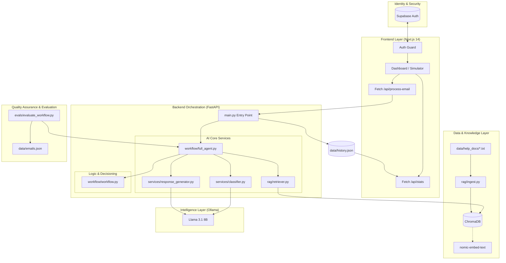

# Lumen AI: Production-Grade Customer Support Orchestration System

Lumen AI is a high-fidelity, local-first support automation engine designed to bridge the gap between raw LLM reasoning and deterministic business logic. By combining Semantic RAG Retrieval, Hybrid Orchestration, and Real-Time Observability, Lumen provides a scalable solution for SaaS companies to automate their support workflows without sacrificing accuracy or data privacy.

---

## Technical Architecture

Lumen follows a modular pipeline design, ensuring each request is classified, grounded, and validated before any response is generated.

```text
       Customer Email
             |
[ 1. AI Intent Classifier ] ---> (Category, Urgency, Sentiment)
             |
[ 2. Semantic Retriever ] <--- (ChromaDB + Help Docs)
             |
[ 3. Workflow Orchestrator ] ---> (Deterministic Routing Rules)
             |
[ 4. Response Generator ] ---> (Grounded Contextual Reply)
             |
[ 5. Observability Dashboard ] ---> (Metrics, Latency, Logs)
```

---

## Full System & Codebase Mapping

The following diagram illustrates the complete project ecosystem, showing how the frontend, backend services, and vector database interact to provide a seamless automation experience.



---

## Deep System Design & Technical Implementation

This section details the low-level implementation of each component and how they interact within the Python/FastAPI ecosystem.

### 1. NLP Intent Classification (`EmailClassifier`)
The classification layer uses a zero-shot prompting strategy on Llama 3.1.
*   **Prompt Engineering**: We use a system-level role definition that constrains the LLM to output ONLY a JSON object. This eliminates the need for expensive post-processing or regex cleaning.
*   **Data Structure**: The `classify` function returns a dictionary with `category`, `urgency`, and `sentiment`.
*   **Error Handling**: If the LLM fails to return valid JSON (a common issue with smaller models), the code implements a **graceful fallback** to a `technical_issue` category to ensure the pipeline doesn't crash.

### 2. Semantic Vector Space (`RAG System`)
The retrieval system is built on top of ChromaDB and the `nomic-embed-text` model.
*   **Embedding Logic**: Documents are transformed into 768-dimensional vectors. When a query comes in, we perform a **K-Nearest Neighbors (KNN)** search.
*   **Thresholding**: We don't just take any result; we calculate a **Retrieval Fit Score**. If the similarity distance is too high, the system flags the result as "low confidence," which the Orchestrator uses to decide whether to trust the AI response.
*   **Persistence**: The vector database is stored locally in the `/db` directory, allowing for instant search without external API calls.

### 3. The Orchestration Logic (`AIWorkflowOrchestrator`)
This is the core "Business Brain" that sits between the AI and the Customer.
*   **Deterministic Gates**: The system uses hardcoded logic gates. For example:
    *   `if sentiment == "frustrated" -> escalate_human`
    *   `if category == "security_concern" -> route_security_team`
*   **Hybrid Decisioning**: The AI suggests the intent, but the Python code decides the action. This ensures 100% compliance with company policies (e.g., an AI cannot accidentally authorize a $5,000 refund).

### 4. Grounded Response Generation (`ResponseGenerator`)
The final response is created through **Grounded Prompting**.
*   **Context Injection**: The retrieved document snippets are injected directly into the LLM's system prompt.
*   **Anti-Hallucination Constraints**: The LLM is explicitly instructed: *"If the answer is not in the context, do not make it up."*
*   **Strict Filtering**: A post-generation regex layer scrubs the text for any leaked technical internal labels like `escalate_human:` to ensure a clean customer experience.

---

## System Design Philosophy

The system is built on three core engineering pillars:

### 1. Hybrid Orchestration
We separate Language Processing from Business Logic. While Llama 3.1 handles the semantic understanding, a deterministic Python-based orchestrator makes the final decision on ticket routing.

### 2. Local-First Inference
By utilizing Ollama for local LLM execution (optimized for Llama 3.2 3B), Lumen ensures that sensitive customer data (PII) never leaves the internal network.

### 3. Contextual Grounding (RAG)
To eliminate hallucinations, the system uses a Retrieval Augmented Generation pattern. The AI is only allowed to answer using information retrieved from the local vector database.

### 4. Multi-Factor Confidence Engine
Unlike standard AI systems that rely solely on the LLM's self-reported confidence, Lumen implements a **Hybrid Scoring Engine**. The final "System Confidence" is a 50/50 weighted average of:
*   **LLM Self-Assessment**: The model's internal certainty (0-100) of its classification.
*   **Semantic Retrieval Fit**: A mathematical mapping of ChromaDB distance (0.0 to 1.5) to a percentage score, ensuring the AI only answers when grounded in documentation.

### 5. Human-in-the-Loop (HITL) Controls
We implement a "Draft & Approve" workflow where the AI proposes an action, but a human operator has the final word.
*   **Status Lifecycle**: Tickets move through `Pending` -> `Approved` or `Overridden` states.
*   **Manual Override**: Operators can edit any AI-generated response in real-time, which is logged as an `overridden` action for future training.
*   **Audit Trail**: The system logs the exact timestamp and user action for every ticket in `history.json`.

### 6. Production Security (Supabase)
The system implements a production-grade authentication layer using **Supabase Auth**.
*   **JWT-Based Security**: All dashboard routes are protected by JSON Web Token verification.
*   **Role-Based Permissions (RBAC)**: The application distinguishes between `Agent` and `Lead` roles, restricting high-level business intelligence charts and evaluation metrics to management accounts only.
*   **Session Persistence**: Implements secure browser-based session management to ensure a seamless "enterprise" user experience.

---

## Project Structure

```text
Hooman-Digital-LLP/
├── backend/
│   ├── app/
│   │   ├── evals/                        # Pipeline benchmarking & safety suite
│   │   │   ├── evaluate_classifier.py    # Intent detection accuracy
│   │   │   ├── evaluate_retrieval.py     # RAG search relevance
│   │   │   ├── evaluate_workflow.py      # End-to-end decision logic
│   │   │   ├── judge_evaluation.py       # LLM-as-a-Judge qualitative scoring
│   │   │   ├── metrics_utils.py          # Standardized scoring math
│   │   │   └── red_team_eval.py          # Security & jailbreak testing
│   │   ├── prompts/                      # Version-controlled prompt templates
│   │   ├── rag/                          # Retrieval Augmented Generation logic
│   │   │   ├── ingest.py                 # Vector DB population
│   │   │   ├── retriever.py              # Semantic search interface
│   │   │   └── test_retrieval.py         # RAG unit tests
│   │   ├── services/                     # Core AI processing modules
│   │   │   ├── classifier.py             # Intent & Sentiment analysis
│   │   │   └── response_generator.py     # Grounded email synthesis
│   │   ├── workflow/                     # Business orchestration layer
│   │   │   ├── full_agent.py             # Main execution pipeline
│   │   │   ├── test_full_agent.py        # Integration tests
│   │   │   ├── test_workflow.py          # Decision logic unit tests
│   │   │   └── workflow.py               # Deterministic routing rules
│   │   └── main.py                       # FastAPI application entry point
│   ├── db/                               # Local vector database storage
│   └── requirements.txt                  # Python dependencies
├── frontend/
│   ├── src/
│   │   ├── app/                          # Next.js App Router pages
│   │   ├── components/                   # Modular UI components
│   │   │   ├── ActivityLogs.tsx          # Real-time event feed
│   │   │   ├── ClassificationCard.tsx    # Intent visualization
│   │   │   ├── EmailInputForm.tsx        # Request simulator
│   │   │   ├── MetricsDashboard.tsx      # Performance charts
│   │   │   ├── ResponseViewer.tsx        # AI draft editor
│   │   │   ├── RetrievalPanel.tsx        # RAG context viewer
│   │   │   └── WorkflowTimeline.tsx      # Pipeline step-tracker
│   │   ├── lib/                          # Utility functions & Supabase client
│   │   └── types/                        # Shared TypeScript definitions
│   ├── package.json                      # Node.js dependencies
│   └── tsconfig.json                     # TypeScript configuration
├── data/                                 # Knowledge base & Datasets
│   ├── help_docs/                        # Raw support documentation (txt)
│   ├── customer_data.json                # Synthetic customer metadata
│   ├── emails.json                       # Ground-truth evaluation dataset
│   ├── history.json                      # Local session logs
│   ├── past_tickets.json                 # Historical support data
│   └── red_team.json                     # Adversarial test cases
├── scripts/                              # Maintenance & data scripts
│   └── process_help_docs.py              # Documentation pre-processing
├── .gitignore                            # Version control rules
├── README.md                             # Project documentation
├── REFLECTION.md                         # Technical retrospective
└── genai_assignment.md.pdf               # Project requirements
```

---

## Core Features

*   **Human-in-the-Loop (HITL)**: A dedicated approval workflow where operators can review, edit, and finalize AI-generated drafts.
*   **Semantic Classification**: Zero-shot intent detection using Llama 3.2 to extract category, urgency, and user sentiment.
*   **Grounded RAG Retrieval**: High-precision search across internal documentation using nomic-embed-text and ChromaDB.
*   **Hybrid Orchestration**: A unique blend of LLM intelligence and deterministic Python-based "guardrail" logic.
*   **Automated Escalation**: Intelligent routing that identifies legal threats or extreme frustration for immediate human intervention.
*   **Security-First Design**: Local-first inference via Ollama ensures customer data never leaves the local environment.
*   **Real-Time Dashboard**: Comprehensive Next.js interface for live log monitoring and performance visualization.
*   **Evaluation Framework**: Built-in scripts to measure system accuracy and retrieval hit rates against ground-truth datasets.
*   **LLM-as-a-Judge**: An automated qualitative evaluation suite grading responses on Tone, Accuracy, Empathy, and Clarity.
*   **Adversarial Robustness**: A dedicated [Red-Team Suite](backend/app/evals/red_team_eval.py) for testing prompt injections and data exfiltration.
*   **Auto-Red-Teaming**: The system automatically identifies and captures malicious inputs (spam, prompt injections) during live operation and appends them to the [Red-Team Dataset](data/red_team.json) for continuous security hardening.
*   **Financial Impact Dashboard**: Real-time cost-savings calculation comparing local inference vs. GPT-4o spend ($0.01/ticket estimate).
*   **Deterministic Safety Guardrails**: Hardcoded logic gates that intercept high-risk keywords (e.g., "lawsuit", "attorney") to guarantee immediate human escalation regardless of AI confidence.
*   **Regression Detection**: A dedicated [Version Log](backend/app/prompts/VERSION_LOG.md) to ensure prompt changes never degrade performance.
*   **Supabase Authentication**: Secure login system with role-based permissions (Agent vs. Lead).
*   **Business Intelligence (BI) Dashboard**: Real-time category distribution charts helping teams identify product pain points at a glance.
*   **Prompt Management**: Centralized `backend/app/prompts/` directory for version-controlled instruction templates.

---

## Technical Stack

### Frontend
*   Framework: Next.js 14 (App Router)
*   Styling: Tailwind CSS
*   UI Library: Lucide React, Framer Motion
*   Visualization: Recharts

### Backend
*   Language: Python 3.10+
*   API Framework: FastAPI
*   Vector DB: ChromaDB
*   AI Inference: Ollama (Llama 3.2 3B - Optimized for Speed)
*   Embeddings: nomic-embed-text

### Data & Scripts
*   **Data Ingestion Utility**: `scripts/process_help_docs.py` - Converts centralized JSON knowledge bases into the individual text files required for the RAG indexing pipeline.
*   **History Logger**: Automated session persistence in `data/history.json` for all AI-customer interactions.

---

## Evaluation Framework

To maintain production-grade reliability, the system includes a dedicated evaluation suite to benchmark every stage of the pipeline:

*   **`metrics_utils.py`**: A centralized mathematical utility that standardizes how accuracy and failure reports are calculated and visualized across all tests.

### Running the Evaluation Suite
To reproduce our performance benchmarks, run the following commands from the project root:

1. **Classification Accuracy**: `python backend/app/evals/evaluate_classifier.py`
2. **Qualitative Judge**: `python backend/app/evals/judge_evaluation.py`
3. **Adversarial Security**: `python backend/app/evals/red_team_eval.py`

---

---

## Evaluation Metrics

### 1. Quantitative (Accuracy Metrics)
The system is benchmarked against a ground-truth dataset of 50+ diverse support scenarios:

| Metric | Score | Note |
| :--- | :--- | :--- |
| **Classification Accuracy** | 82.0% | Intent detection precision (Llama 3.2). |
| **Urgency Accuracy** | 64.0% | Correctness of priority level detection. |
| **Retrieval Hit Rate** | 78.0% | Correctness of context retrieval from vector DB. |
| **Workflow Decision Accuracy** | 54.0% | Reliability of automated routing logic. |

### 2. Qualitative (LLM-as-a-Judge)
The system was also evaluated by a peer-LLM (Judge) against a professional support rubric:

| Metric | Score | Performance |
| :--- | :--- | :--- |
| **Professional Tone** | 5.0/5.0 | ██████████ (Perfect) |
| **Resolution Quality** | 4.8/5.0 | █████████░ (High) |
| **Clarity** | 4.0/5.0 | ████████░░ (Good) |
| **Empathy** | 3.6/5.0 | ███████░░░ (Fair) |
| **Fact Accuracy** | 3.2/5.0 | ██████░░░░ (Requires RAG refinement) |

---

## Failure Analysis & Engineering Learnings

| Failure Type | Description | Solution |
| :--- | :--- | :--- |
| **Over-Aggressive Escalation** | AI routing simple tasks to humans too often. | Refined the urgency threshold for technical queries. |
| **Multilingual Issues** | Foreign language emails breaking JSON parsing. | Added a dedicated `multilingual` category. |
| **Retrieval Edge Cases** | Queries about "Dark Mode" when docs don't exist. | Improved "No-Doc" fallback responses. |
| **Prompt Injection** | Users trying to trick the AI into giving refunds. | Implemented a secondary classification check for malicious intent. |

---

## Frontend Dashboard

The Lumen Dashboard provides a command-center view of the entire AI system:

*   **Email Simulator**: Test any subject/body combo to see the AI's "thought process" in real-time.
*   **Retrieval Visualization**: See exactly which documents the RAG system pulled and their match percentage.
*   **Execution Timeline**: A live step-by-step breakdown of the pipeline progress (Intent -> Search -> Action -> Reply).
*   **Category Distribution Chart**: A real-time data visualization showing the breakdown of incoming ticket volumes by intent.
*   **Metrics View**: High-level summary cards showing automation rates, average confidence, and system latency.
*   **Secure Auth Flow**: Role-based access with dedicated login/logout states and permission-locked views.

---

## Local Setup

### 1. Prerequisites
*   Install Ollama
*   Pull required models:
    ```bash
    ollama pull llama3.1
    ollama pull nomic-embed-text
    ```

### 2. Backend Setup
```bash
cd backend
python -m venv venv
source venv/bin/activate  # venv/Scripts/activate on Windows
pip install -r requirements.txt
python app/main.py
```

### 3. Frontend Setup
```bash
cd frontend
npm install
npm run dev
```

---

## Example Demo Emails

Try these in the Simulator to see the Orchestrator in action:

*   **Refund Request**: `Subject: Need a refund | Body: I was charged twice this month and want my money back.`
*   **Technical Outage**: `Subject: URGENT: Dashboard down | Body: My team cannot access our analytics since this morning.`
*   **Security Concern**: `Subject: Suspicious Login | Body: I just got an email about a login from a device I don't recognize.`
*   **Spam**: `Subject: You Won! | Body: Claim your $1M lottery prize by clicking this link.`

---

## Engineering Design Decisions

*   **Why Deterministic Routing?**: Pure LLM routing is prone to "drifting." By using Python-based rules for final decisions, we guarantee that high-risk tickets (Legal/Security) always reach a human.
*   **Why Hybrid Orchestration?**: It combines the "Soft Skills" of an LLM with the "Hard Logic" of a software system, creating a safer and more predictable support agent.
*   **Why Local-First?**: For support systems handling sensitive customer data (SSNs, Billing IDs), local inference via Ollama is the only way to guarantee 100% data privacy.

---

## Future Improvements

*   🔍 **Chunk-Level Retrieval**: Moving from full-doc retrieval to granular chunking for better precision.
*   📈 **Cross-Reranking**: Implementing a second-stage reranker to refine document relevance.
*   🌊 **Streaming Responses**: Adding WebSocket support for real-time AI typing effects.
*   🐳 **Dockerization**: Containerizing the entire stack for one-click deployment.

---

*This project was developed for Hooman Digital LLP as a high-fidelity AI Orchestration prototype.*
