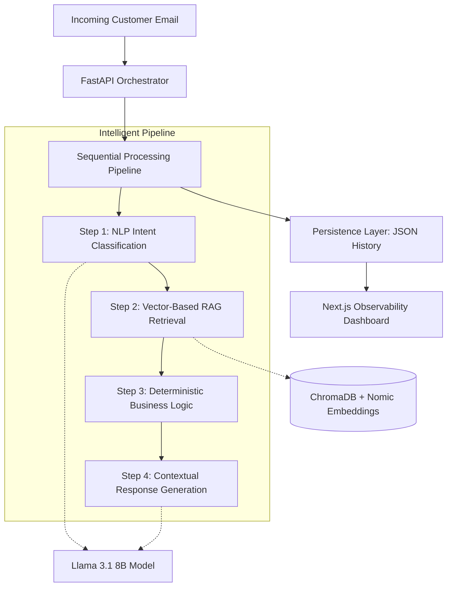

# Lumen AI: Support Orchestration & Observability System

Lumen AI is a high-fidelity, local-first support automation system designed to optimize customer service workflows through intelligent intent classification, context-aware retrieval, and deterministic decision-making. The system provides an end-to-end observability dashboard to monitor AI performance, system latency, and workflow accuracy.

---

## Technical Architecture and System Design

The architecture is built on a modular micro-service pattern, ensuring clear separation between intent analysis, knowledge retrieval, and response generation.

---

## Component Deep-Dive

### 1. Intent Classification Engine (services/classifier.py)
The classification layer is the "brain" of the system. It utilizes Llama 3.1 (8B) to perform zero-shot classification on raw email content. 
*   **Structured Output**: We enforce a JSON schema via Ollama's `format="json"` capability to ensure stable integration.
*   **Intent Parameters**: It extracts four critical dimensions:
    *   **Category**: Mapped against a predefined taxonomy (Billing, Tech, Account, etc.).
    *   **Urgency**: Scaled from Low to High based on semantic cues (e.g., "locked out", "urgent").
    *   **Sentiment**: Detects user frustration levels to trigger preemptive human escalation.
    *   **Reasoning**: A self-explanation from the LLM used for debugging classification failures.

### 2. Retrieval Augmented Generation (RAG) (rag/retriever.py)
To prevent LLM hallucination, the system utilizes a Retrieval Augmented Generation pattern.
*   **Vectorization**: Help documents are chunked and converted into 768-dimensional vectors using the `nomic-embed-text` model.
*   **Similarity Search**: We perform a Cosine Similarity search within a local ChromaDB collection.
*   **Grounded Context**: The top-ranked snippets are injected into the final prompt, ensuring the AI only answers based on approved company documentation.
*   **Retrieval Fit Score**: A confidence metric (0-100) is calculated based on the distance between the query vector and the document vectors.

### 3. Deterministic Decision Engine (workflow/workflow.py)
Unlike pure AI systems that can be unpredictable, Lumen uses a "Guardrail" decision engine. 
*   **Heuristic Overlays**: The orchestrator checks for specific "Critical Keywords" (Legal, Security, Lawsuit) before allowing the AI to reply.
*   **Routing Logic**:
    *   **High Urgency/Frustration**: Automatically bypasses the AI and routes to a human agent (`escalate_human`).
    *   **Information Queries**: If documents are found and confidence is high, it triggers `auto_reply`.
    *   **Technical/Billing**: Routes to specialized human teams for further investigation.

### 4. Contextual Response Generation (services/response_generator.py)
The final layer converts technical data into a professional customer email.
*   **Prompt Engineering**: We use a highly constrained system prompt that forbids "fluff" and mandates grounding in the retrieved context.
*   **Output Scrubbing**: To maintain professional standards, a post-generation filter programmatically removes any internal technical labels (e.g., "Action: escalate_human") that may leak from the LLM output.

---

## Observability and Performance Metrics

The system is designed with a "Metrics-First" philosophy, enabling real-time performance tracking.

### Latency Measurement
We track the "Full-Trip" latency by measuring individual timestamps for:
1.  **Classification Latency**: The compute time required for intent analysis.
2.  **Retrieval Latency**: The search time across the vector store.
3.  **Generation Latency**: The token generation time for the final response.
4.  **Total Pipeline Latency**: The end-to-end duration from email receipt to final output.

### Accuracy and Evaluation
The `backend/app/evals` suite allows for rigorous testing:
*   **Workflow Evaluation**: Compares AI decisions against 50 ground-truth samples to calculate an **Accuracy Percentage**.
*   **Retrieval Evaluation**: Measures the relevance of the RAG system to ensure the correct help documents are being served.

---

## Technical Stack

*   **Runtime**: Python 3.10+, Node.js 18+
*   **Frameworks**: FastAPI (Backend), Next.js 14 (Frontend)
*   **AI Models**: Llama 3.1 (8B Instruct), Nomic-Embed-Text (v1.5)
*   **Vector Store**: ChromaDB
*   **Persistence**: Structured JSON Flat-Files (History & Metrics)
*   **Visuals**: Recharts (Charting), Lucide (Icons), Framer Motion (Transitions)

---

*This system was developed as a production-grade orchestration prototype for Hooman Digital LLP.*
